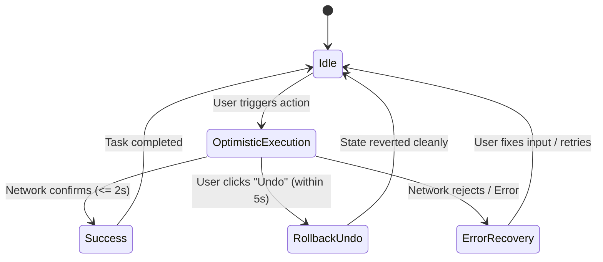

# Interaction Flows, State Machines & Agentic Contracts

This reference governs the behavioral dynamics of interactive systems, state transition modeling, error reversibility, and modern contracts for autonomous AI agent interfaces.

---

## 1 · Finite State Machine (FSM) Modeling for Interactions

Amateur interfaces suffer from "state explosion" and edge-case freezes because states are tracked with scattered boolean flags (`isLoading`, `isError`, `hasSuccess`, `isSubmitting`). 

Every non-trivial interaction must be modeled as a formal, deterministic state machine:



### The 6 Canonical Interaction States
1. **`Idle`**: Component is mounted, stable, and ready to accept user input. Affordances clearly signal interactivity.
2. **`OptimisticExecution`**: The interface immediately updates its UI as if the backend operation succeeded, giving zero-latency feedback ($\le 100\text{ms}$). A transient Undo toast appears.
3. **`Pending / Progress`**: Used when optimistic execution is impossible (e.g. file upload, payment authorization, AI generation). Shows skeleton placeholder or deterministic progress indicator.
4. **`Success`**: Transient confirmation state (e.g. green checkmark pulse, success banner). Transitions back to `Idle` automatically after $2 - 3\text{s}$.
5. **`Rollback / Undo`**: If the user clicks "Undo" or the network fails, the UI gracefully rolls back to its exact previous state without data loss.
6. **`ErrorRecovery`**: Clear, non-blocking notification showing what failed and providing a 1-click retry affordance.

---

## 2 · Optimistic Execution & Reversible Undo Patterns

### 2.1 The Modal Confirmation Anti-Pattern
Prompting the user with a modal dialog saying *"Are you sure you want to delete this item?"* is a recognized UX antipattern for routine operations:
* **Modal Fatigue**: Users develop muscle memory to click "Yes" without reading the prompt.
* **Flow Interruption**: It introduces a disruptive context switch, breaking cognitive immersion.

### 2.2 The Reversible Undo Protocol
For reversible actions (archiving, deleting, moving, updating status), use the **Soft-Delete + Undo Banner Pattern**:

```
┌────────────────────────────────────────────────────────┐
│ [Project 'Alpha' moved to archive]        [ UNDO (5s) ]│
└────────────────────────────────────────────────────────┘
```

#### Protocol Rules:
1. **Immediate Visual Removal**: Instantly remove the item from the visible list or strike it through with an animation.
2. **5-Second Grace Window**: Display a non-blocking floating banner (snackbar/toast) with an explicit `[Undo]` button.
3. **Delayed Network Mutation**: Defer permanent deletion on the backend until the 5-second timer expires, or execute a reversible soft-delete (`archived_at = NOW()`).
4. **Instant Restoration**: If the user clicks `[Undo]`, restore the item to its exact previous position in the UI instantly.

> **Exception (Irreversible Operations)**: Truly irreversible operations with massive blast radius (e.g. deleting a production database, dropping a repository, destroying crypto keys) DO require explicit confirmation. For high-blast actions, require the user to type the exact resource name rather than just clicking "OK".

---

## 3 · Form UX & Inline Validation Ergonomics

1. **Reward Early, Punish Late**:
   * **Never validate on keystroke for empty fields**: Do not show a red error *"Email is required"* while the user is still typing their very first character.
   * **Validate on Blur**: Evaluate validity when the user tabs or clicks away from the field.
   * **Validate Inline While Correcting**: Once a field has been marked invalid, switch to live validation on keystroke so the user immediately sees the red error disappear as soon as they fix it.
2. **Input Masking & Smart Formatting**:
   * Automatically format phone numbers, credit cards, dates, and currency as the user types.
   * Strip formatting characters automatically on paste.
3. **Preserve Form State on Failure**:
   * Never clear input fields if a form submission fails on the backend. Preserve every character typed, highlight the specific failing fields, and scroll to the first error.

---

## 4 · Modern Autonomous AI & Agentic Interaction Contracts

Traditional HCI assumed deterministic, instantaneous software. Autonomous AI agents, streaming LLMs, and probabilistic reasoning introduce unique UX challenges that require strict interaction contracts:

```
┌────────────────────────────────────────────────────────────────────────┐
│                   THE 4 AI INTERACTION CONTRACTS                       │
├────────────────────────────────────────────────────────────────────────┤
│ 1. Streaming Perception   │ Initial semantic token in ≤ 200ms          │
│ 2. Tool Blast Mediation   │ Pre-flight inspection for file/DB mutations│
│ 3. Sovereign Steering     │ Instant cancel, pause, redirect at any turn│
│ 4. Attribution Grounding  │ Causal anchors linking output to source    │
└────────────────────────────────────────────────────────────────────────┘
```

### 4.1 Streaming Perception & Time-to-First-Token (TTFT)
* An AI model may take 15 seconds to generate a full response. If the UI displays a blank box with a generic spinner, the user assumes the application crashed.
* **The 200ms Rule**: The system must emit an immediate visual acknowledgment (e.g. streaming semantic tokens, an active thinking pulse, or an initial status message: `"Analyzing code..."`) within $\le 200\text{ms}$.

### 4.2 Blast-Radius Mediation for Tool Calls
When an autonomous agent invokes tools that mutate persistent state (creating files, executing terminal commands, modifying databases, making API payments):
1. **Pre-Flight Declaration**: Expose the tool name, target parameters, and intended action before executing high-impact operations.
2. **Human-in-the-Loop Thresholds**:
   * *Read-Only Tools* (reading files, searching docs): Execute autonomously without interruption.
   * *Mutating Tools* (editing code, creating branches): Execute with clear visual indication and undo snapshots.
   * *Destructive Tools* (deleting files, dropping tables, pushing to main): Require explicit human confirmation.

### 4.3 Sovereign User Steering
The human user must remain in absolute control of the agent:
* Provide an immediate, unhindered **`[Stop Generating]` / `[Cancel]`** affordance at all times.
* Allow users to edit their previous prompt or branch into a new conversation thread without losing history.

### 4.4 Attribution & Confidence Grounding
* When an AI agent provides citations, data points, or code fixes, every claim must link directly to the source file or document (e.g., `[src/auth.ts:L42](file:///...)`).
* Never present speculative or unverified claims as absolute facts.
