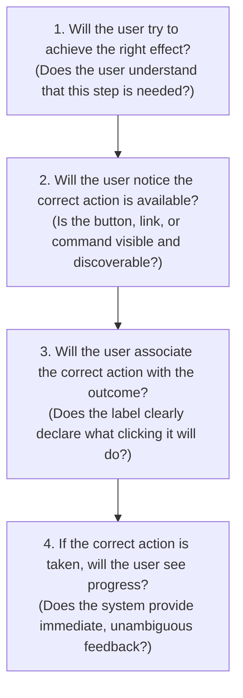

# Usability Auditing, Heuristic Scoring & Severity Metrics

This reference governs the empirical auditing of user interfaces, cognitive walkthroughs, and the strict mathematical finding schema required to eliminate subjective noise.

---

## 1 · The Nielsen 0–4 Usability Severity Scale

When auditing an interface, every identified usability issue must be classified using the standardized Nielsen 0–4 Severity Scale. This prevents minor cosmetic nits from blocking critical releases and ensures high-friction blockers receive immediate remediation:

```
┌────────────────────────────────────────────────────────────────────────┐
│                    THE 5-TIER USABILITY SEVERITY SCALE                 │
├────────┬───────────────┬───────────────────────────────────────────────┤
│ Tier   │ Classification│ Operational Definition & Task Impact          │
├────────┼───────────────┼───────────────────────────────────────────────┤
│ Tier 0 │ Cosmetic Only │ No impact on task completion; minor phrasing  │
│        │               │ polish or aesthetic alignment. Optional fix.  │
├────────┼───────────────┼───────────────────────────────────────────────┤
│ Tier 1 │ Minor Friction│ Mild hesitation; user easily recovers without │
│        │               │ assistance. Low priority fix.                 │
├────────┼───────────────┼───────────────────────────────────────────────┤
│ Tier 2 │ Moderate Hurt │ Noticeable confusion or delay; user completes │
│        │               │ task with high effort and repeat errors.      │
├────────┼───────────────┼───────────────────────────────────────────────┤
│ Tier 3 │ Major Defect  │ Severe blocker; significant % of users fail or│
│        │               │ abandon the task. High priority release block.│
├────────┼───────────────┼───────────────────────────────────────────────┤
│ Tier 4 │ Catastrophic  │ Complete task failure; unrecoverable data loss│
│        │               │ or security compromise. Must fix immediately. │
└────────┴───────────────┴───────────────────────────────────────────────┘
```

### Classification Decision Matrix

$$\text{Severity} = f(\text{Frequency}, \text{Impact}, \text{Persistence})$$

* **Frequency**: Is it common or rare? (Does it hit every user on every visit, or 1% on an edge case?)
* **Impact**: Can the user easily overcome the hurdle, or does it halt them completely?
* **Persistence**: Once learned, is it still a problem, or do users adapt?

---

## 2 · The Mathematical Finding Citation Protocol

Subjective criticisms (e.g. *"The navigation feels slightly clumsy"* or *"The visual balance is off"*) are **strictly forbidden**. Every audit finding must satisfy this mathematical schema:

$$\text{Finding} = [\text{Component/Line Anchor}] + [\text{Specific Invariant/Heuristic Violated}] + [\text{Severity 0–4}] + [\text{Concrete Code Remediation}]$$

### Required Markdown Template
```markdown
### [FINDING-ID] Descriptive Finding Title
- **Anchor**: `path/to/Component.tsx:L45-L60`
- **Violated Invariant**: Invariant X (e.g., Invariant 4: Reversible Action & Error Tolerance) / Nielsen Heuristic #N
- **Severity**: [0 | 1 | 2 | 3 | 4] - [Cosmetic | Minor | Moderate | Major | Catastrophic]
- **Observed Behavior**: Exact description of what happens during interaction and why it causes friction or failure.
- **Root Cause**: The underlying flaw in the state machine, markup, or copy.
- **Remediation**:
```language
// Complete, drop-in replacement code resolving the defect
```
```

---

## 3 · The Cognitive Walkthrough Protocol

To evaluate a user journey before deployment, walk through each step of the critical path and answer the **4 Canonical Walkthrough Questions**:



If the answer to **any** of these four questions is "No", an audit finding must be logged at the corresponding severity level.

---

## 4 · The Distilled 168-Principle Audit Lenses

The 168 empirical UX principles are structured into 7 functional audit lenses:

### Lens 1: Information Architecture & Wayfinding
* *P1.1*: Hierarchy matches user domain objects, not database tables.
* *P1.2*: No navigation tree exceeds 3 levels without active breadcrumbs.
* *P1.3*: Active screen title matches the navigation link clicked.
* *P1.4*: Global search supports typos and forgiving keyword matches.

### Lens 2: Cognitive Load & Hick-Hyman Pruning
* *P2.1*: Root-level choices in any menu or view do not exceed $7 \pm 2$.
* *P2.2*: Intelligent default options pre-selected for $80\%$ of typical use cases.
* *P2.3*: Advanced configuration concealed behind progressive disclosure.
* *P2.4*: Tabular numbers used for all comparative numerical data.

### Lens 3: Interaction Mechanics & Feedback
* *P3.1*: Every button click, tap, or keydown receives feedback within $\le 100\text{ms}$.
* *P3.2*: Async tasks lasting $> 400\text{ms}$ display skeleton screens or progress bars.
* *P3.3*: No screen frozen or non-interactive without a loading indicator.
* *P3.4*: State changes (saves, archives) accompanied by transient toast feedback.

### Lens 4: Error Prevention & Reversibility
* *P4.1*: Destructive actions use soft-delete + 5-second undo toast over modal confirmation.
* *P4.2*: Form inputs validate on blur or during correction, never on initial keystroke.
* *P4.3*: Forms preserve all entered data during network or validation failure.
* *P4.4*: Irreversible actions require typing the resource name to confirm.

### Lens 5: Content & Microcopy Ergonomics
* *P5.1*: Action labels explicitly name their outcome (e.g. `"Create Project"`, not `"Submit"`).
* *P5.2*: Error messages follow the 3-part formula: Cause + Impact + Recovery Link.
* *P5.3*: Jargon and raw stack traces eliminated from user-facing copy.
* *P5.4*: Empty states describe what belongs here and offer a 1-click on-ramp button.

### Lens 6: Universal Accessibility & Assistive Tech
* *P6.1*: Full keyboard navigation parity (every action triggerable via keyboard).
* *P6.2*: Visible, high-contrast keyboard focus indicators maintained on all controls.
* *P6.3*: ARIA live regions (`aria-live="polite"`) used for dynamic content updates.
* *P6.4*: Form fields programmatically bound to labels via `for` / `id` or `aria-labelledby`.

### Lens 7: Modern AI & Agentic Interfaces
* *P7.1*: Streaming generation starts within $\le 200\text{ms}$ of prompt dispatch.
* *P7.2*: Tool calls mutating state require pre-flight visibility or rollback options.
* *P7.3*: AI citations anchor directly to underlying files and line numbers.
* *P7.4*: User retains instant stop, pause, and edit steering control at all times.
