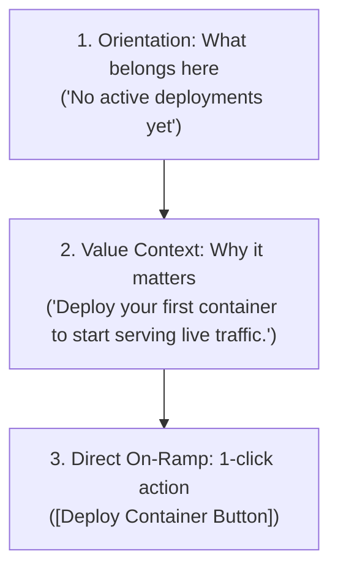

# UX Writing, Content Ergonomics & Microcopy Protocol

This reference defines the judgment rules for all user-facing language. Language in software is not decorative prose; it is a primary functional affordance that guides action, prevents errors, and reduces cognitive load.

---

## 1 · The 3-Part Error Message Invariant

Uninformative error messages (e.g. *"An error occurred"*, *"Invalid input"*, *"Failed with code 500"*) are critical UX failures. Every error message must contain three explicit components:

```
┌────────────────────────────────────────────────────────────────────────┐
│                   THE 3-PART ERROR FORMULA                             │
├────────────────────────────────────────────────────────────────────────┤
│ 1. The Cause      │ What happened in plain human language              │
│ 2. The Impact     │ What happened to the user's data / state           │
│ 3. The Recovery   │ A concrete, immediate action or link to fix it     │
└────────────────────────────────────────────────────────────────────────┘
```

### Comparative Examples

| Bad / Hostile Copy | The 3-Part Ergonomic Replacement |
| :--- | :--- |
| ❌ `"Network error 504 Gateway Timeout"` | ✅ **"Unable to connect to the billing server.** Your changes are saved as a local draft. **[Retry Connection]"** |
| ❌ `"Invalid date format entered"` | ✅ **"Date must follow Month/Day/Year (e.g. 09/24/2026).** We updated the format for you: **[Use 09/24/2026]"** |
| ❌ `"Forbidden: You do not have permissions"` | ✅ **"You need Admin access to delete projects.** Request access from your team owner (owner@acme.com). **[Send Access Request]"** |
| ❌ `CLI: "panic: file not found at /etc/cfg.json"` | ✅ `CLI: "Configuration file '/etc/cfg.json' is missing. Run 'tool init' to generate a default config file."` |

---

## 2 · Call-to-Action (CTA) Labeling: The Outcome Invariant

Never use generic, passive, or ambiguous verbs for interactive triggers. The label on a button or link must explicitly declare the resulting outcome:

```
┌────────────────────────────────────────────────────────┐
│                 THE CTA OUTCOME INVARIANT              │
├────────────────────────────┬───────────────────────────┤
│ Lazy / Ambiguous Labels    │ Explicit Outcome Labels   │
├────────────────────────────┼───────────────────────────┤
│ ❌ "Submit"                │ ✅ "Create Database"       │
│ ❌ "OK"                    │ ✅ "Archive Project"       │
│ ❌ "Next"                  │ ✅ "Continue to Payment"   │
│ ❌ "Save"                  │ ✅ "Publish Changes"       │
│ ❌ "Click Here"            │ ✅ "Download PDF Invoice"  │
│ ❌ "Delete" (in modal)     │ ✅ "Delete 4 Documents"    │
└────────────────────────────┴───────────────────────────┘
```

### The "I Want To..." Test
To test any button label, place it inside the sentence:
$$\text{"I want to } [\text{Button Label}]"$$
* *"I want to Submit"* $\to$ Ambiguous.
* *"I want to Download Audit Log"* $\to$ Unambiguous.

---

## 3 · Empty State Architecture

When a list, table, dashboard, or project directory contains zero data items, displaying a blank screen or a terse *"No Data"* label causes anxiety and confusion. Every empty state must have three structural elements:



### Multi-Platform Examples
* **Web SaaS Dashboard**:
  > **Icon**: Server icon (muted).  
  > **Heading**: *"No API keys created yet"*  
  > **Body**: *"Generate an API key to authenticate your SDK integrations and background workers."*  
  > **Action**: `[+ Create First API Key]`

* **CLI / Terminal Empty State**:
  > ```bash
  > $ project list
  > No projects found in current workspace.
  > 
  > Run 'project new <name>' to create your first project,
  > or 'project clone <url>' to pull an existing repository.
  > ```

---

## 4 · Eliminating Jargon & Blaming Copy

Software copy must never shift systemic blame onto the user or leak internal plumbing terminology:

### 4.1 Eradicating Accusatory Phrasing
* ❌ *"You forgot to fill out the email field."*  
  $\to$ ✅ *"Email address is required."*
* ❌ *"You entered an invalid password."*  
  $\to$ ✅ *"Password must be at least 8 characters with one number."*
* ❌ *"You are not authorized."*  
  $\to$ ✅ *"This document requires Editor permissions."*

### 4.2 Eradicating Engineering Jargon
* ❌ *"Payload deserialization failure."*  
  $\to$ ✅ *"We could not read the uploaded CSV file. Please ensure it uses UTF-8 encoding."*
* ❌ *"Backend 500 Internal Server Error."*  
  $\to$ ✅ *"Our servers are currently experiencing high load. We have saved your draft. [Retry Now]"*
* ❌ *"Row UUID mismatch."*  
  $\to$ ✅ *"The item you are editing was modified in another window. [Reload Latest Version]"*

---

## 5 · Helper Text & Tooltip Ergonomics

1. **Placeholders Are Not Labels**:
   * Never rely on input placeholder text (`placeholder="Enter your name"`) as a form field label. As soon as the user types, the placeholder disappears, stripping the field of all context.
   * Always provide an explicit, persistent `<label>`.
2. **Helper Text Belongs Below the Field**:
   * Keep essential formatting requirements (e.g., *"Must include country code: +1"*) continuously visible immediately below the input.
3. **Tooltips for 'Why', Not 'What'**:
   * Do not use tooltips to restate the obvious (e.g. hovering over a "Print" button showing a tooltip that says "Print").
   * Use tooltips to explain non-obvious rationale (e.g. hovering over a disabled button: *"Disabled because balance is below minimum threshold ($50)"*).
